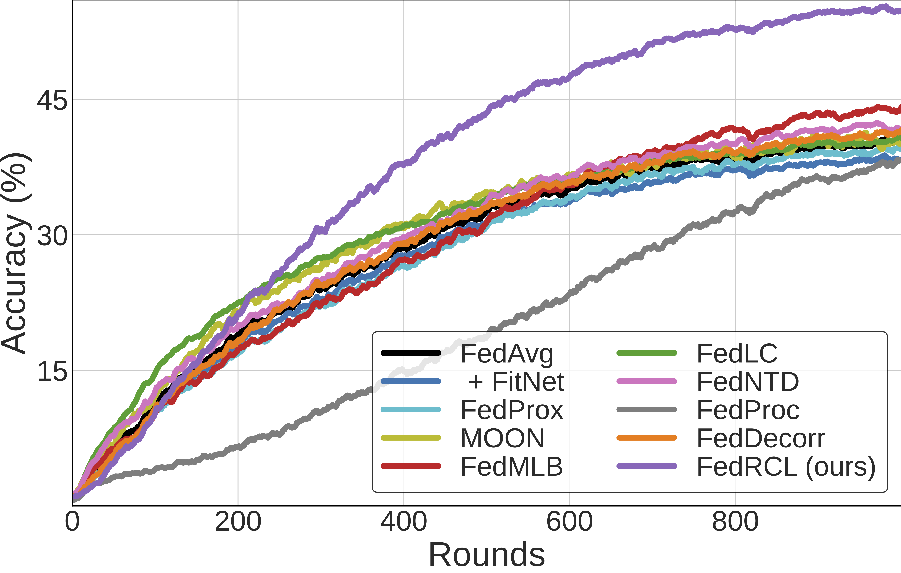

# Relaxed Contrastive Learning for Federated Learning
### Pytorch implementation of FedRCL (CVPR 2024)
[Seonguk Seo](https://seoseong.uk/)\*,  [Jinkyu Kim](https://jinkyu032.vercel.app)\*, [Geeho Kim](https://geehokim.github.io)\*, [Bohyung Han](https://cv.snu.ac.kr/~bhhan/)


<br/>

<em><strong>Convergence curves of FedRCL on CIFAR-100 dataset</strong></em>


### [[Paper]](https://arxiv.org/abs/2401.04928)

> <p align="center">  <figcaption align="center"><b></b></figcaption>
> We propose a novel contrastive learning framework to effectively address the challenges of data heterogeneity in federated learning. We first analyze the inconsistency of gradient updates across clients during local training and establish its dependence on the distribution of feature representations, leading to the derivation of the supervised contrastive learning (SCL) objective to mitigate local deviations. In addition, we show that a na\"ive integration of SCL into federated learning incurs representation collapse, resulting in slow convergence and limited performance gains. To address this issue, we introduce a relaxed contrastive learning loss that imposes a divergence penalty on excessively similar sample pairs within each class. This strategy prevents collapsed representations and enhances feature transferability, facilitating collaborative training and leading to significant performance improvements. Our framework outperforms all existing federated learning approaches by significant margins on the standard benchmarks, as demonstrated by extensive experimental results.


<br>

## Installation
```
git clone https://github.com/skynbe/FedRCL.git
conda env create -f requirement.yaml -n fedrcl
conda activate fedrcl
```
- Download Tiny-ImageNet dataset at $ROOT_PATH/data

  
### Quick Start 

FedRCL training on CIFAR-10/CIFAR-100/Tiny-ImageNet dataset (100 clients, 5% particiaption rate, $\alpha=0.3$):
```
python federated_train.py client=fedrcl dataset=cifar10 trainer.num_clients=100 trainer.participation_rate=0.05 split.alpha=0.3
python federated_train.py client=fedrcl dataset=cifar100 trainer.num_clients=100 trainer.participation_rate=0.05 split.alpha=0.3
python federated_train.py client=fedrcl dataset=tinyimagenet trainer.num_clients=100 trainer.participation_rate=0.05 split.alpha=0.3
```

## Citation

If you find our work useful in your research, please cite:

```
@inproceedings{seo2024relaxed,
  title={Relaxed Contrastive Learning for Federated Learning},
  author={Seo, Seonguk and Kim, Jinkyu and Kim, Geeho and Han, Bohyung},
  booktitle={Proceedings of the IEEE/CVF Conference on Computer Vision and Pattern Recognition},
  year={2024}
}
```

